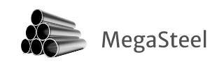
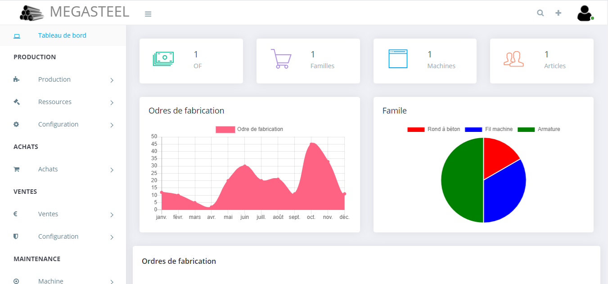

## Introduction

MegaSteel is an open-source integrated management software package comprising a large number of modules to meet many business management needs (ERP) for metal manufacturer companies.

## Informations

-   Status: under development
-   Latest version 1.0
-   Sector: education
-   Created: September 2020
-   Last updated: October 2020

## Table of contents
* [Documentation](#general-info)
* [Demo](#demo)
* [Screenshots](#screenshots)
* [Technologies](#technologies)
* [Setup](#setup)
* [Features](#features)
* [Status](#status)
* [Contact](#contact)
* [License](#license)

## Documentation
https://github.com/aniskchaou/MEGASTEEL-FRONTEND-ADMIN/wiki

## Demo
https://pfe2017-backend-production.herokuapp.com/

## Screenshots

## Technologies
* Spring boot
* Angular

## Setup

## Features
-   Manage Production 
-   Manage Purchases 
-   Manage Sales 
-   Manage Maintenance 
- Manage  Human ressources

## Contact
contact@delta-dev-software.com

## License
<a href="license.txt">MIT License</a>